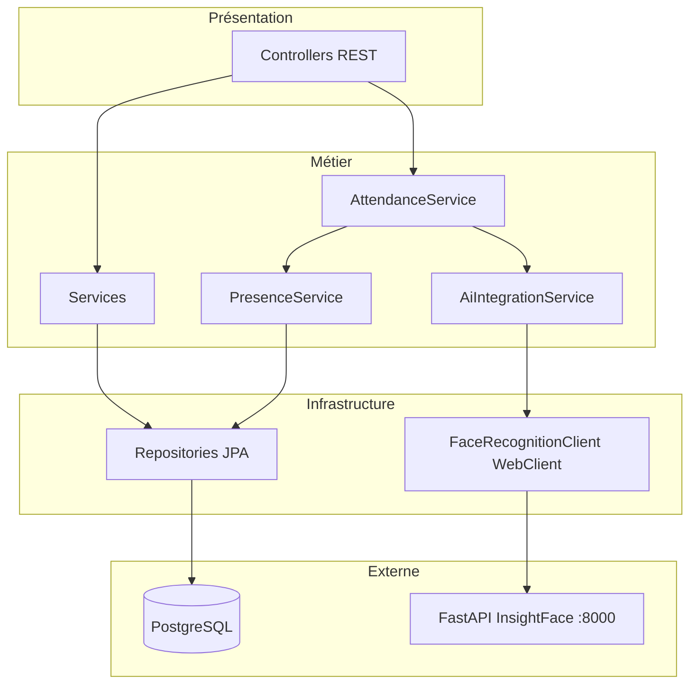
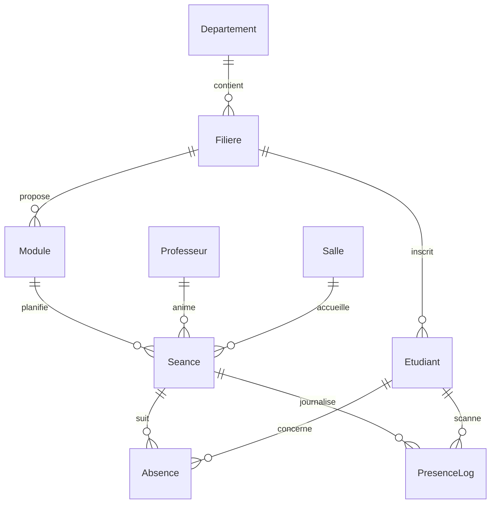
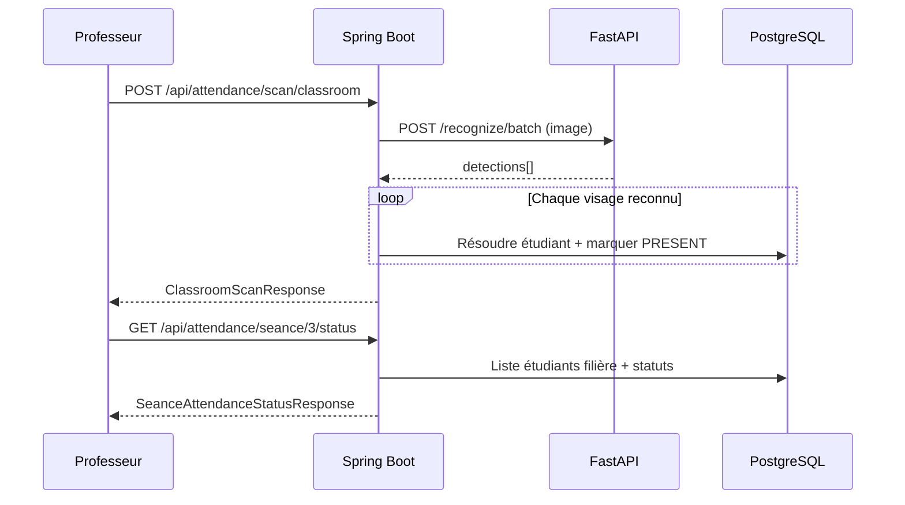

# FSTracker — Backend (Gestion des absences)

API REST **Spring Boot 3.x** du projet **FSTracker** : gestion des absences universitaires, séances, filières, et **marquage de présence par reconnaissance faciale** via un microservice IA externe (FastAPI + InsightFace).

| Composant | Port par défaut |
|-----------|-----------------|
| Backend Spring Boot | `8086` |
| PostgreSQL | `5432` |
| Microservice IA (`Face-Recognition/`) | `8000` |

---

## Technologies

- **Java 21** · **Spring Boot 3.2**
- **Spring Security** + **JWT** (stateless)
- **Spring Data JPA** · **PostgreSQL**
- **MapStruct** (Entity ↔ DTO)
- **Spring WebFlux WebClient** (client HTTP vers le service IA)
- **Springdoc OpenAPI** (Swagger UI)
- **Lombok** · **JUnit 5** · **Mockito**

---

## Démarrage rapide

### Prérequis

- JDK 21+
- Maven 3.9+
- PostgreSQL avec une base `absences_db`
- Microservice IA démarré (voir [`../Face-Recognition/README.md`](../Face-Recognition/README.md))

### Configuration

Éditer `src/main/resources/application.properties` :

```properties
spring.datasource.url=jdbc:postgresql://localhost:5432/absences_db
spring.datasource.username=<votre_utilisateur>
spring.datasource.password=<votre_mot_de_passe>

application.ai-service.url=http://localhost:8000
server.port=8086
```

### Lancer l’application

```bash
cd backend
./mvnw spring-boot:run
# ou
mvn spring-boot:run
```

Au premier démarrage, `DataSeeder` initialise des données de test (admin, professeur, étudiants, séance IA active).

### Documentation interactive

- **Swagger UI** : [http://localhost:8086/swagger-ui.html](http://localhost:8086/swagger-ui.html)
- **OpenAPI JSON** : [http://localhost:8086/v3/api-docs](http://localhost:8086/v3/api-docs)

### Comptes de test (après seed)

| Rôle | Email | Mot de passe |
|------|-------|--------------|
| Admin | `admin@uca.ma` | `admin1234` |
| Professeur | `tazi@uca.ma` | `prof1234` |
| Étudiant (IA) | `mohammed.elomri@etu.uca.ma` | `student1234` |

Les logs au démarrage affichent le **`seanceId`** à utiliser pour les tests de scan IA.

---

## Architecture

### Couches



| Couche | Package | Rôle |
|--------|---------|------|
| **Controller** | `controller/` | Endpoints HTTP, validation, sécurité `@PreAuthorize` |
| **Service** | `service/interfaces`, `service/impl/` | Règles métier, transactions |
| **Client IA** | `client/` | Appels HTTP multipart vers FastAPI (aucune logique IA) |
| **Repository** | `repository/` | Accès PostgreSQL (Spring Data JPA) |
| **Entity** | `entity/` | Modèle persistant JPA |
| **DTO** | `dto/request`, `dto/response`, `dto/external/` | Échange JSON / réponses FastAPI |
| **Mapper** | `mapper/` | MapStruct Entity ↔ DTO |
| **Config** | `config/` | Sécurité, WebClient, seed données |
| **Exception** | `exception/` | Gestion centralisée (`GlobalExceptionHandler`) |

### Principe IA

Spring Boot **ne contient pas** de modèle de vision. Il délègue à `Face-Recognition` :

```
Client → AttendanceController → AttendanceService → AiIntegrationService
      → FaceRecognitionClient (WebClient) → POST http://localhost:8000/recognize*
      → Résolution étudiant + PresenceService → PostgreSQL
```

Détail du microservice : [`../Face-Recognition/README.md`](../Face-Recognition/README.md).

### Modèle de données (entités principales)



| Entité | Description |
|--------|-------------|
| `User` / `Admin` / `Professeur` / `Etudiant` | Utilisateurs (héritage JOINED) |
| `Departement`, `Filiere`, `Module` | Organisation académique |
| `Salle`, `Seance` | Lieux et créneaux de cours |
| `Absence` | Statut `PRESENT` / `ABSENT` / `JUSTIFIE` par étudiant et séance |
| `PresenceLog` | Trace d’un scan (source `AI` ou `MANUAL`, score de confiance) |

---

## Authentification

### Obtenir un token

**`POST /api/auth/login`** — public, sans JWT.

```bash
curl -X POST http://localhost:8086/api/auth/login \
  -H "Content-Type: application/json" \
  -d '{"email":"admin@uca.ma","password":"admin1234"}'
```

**Réponse :**

```json
{
  "token": "eyJhbGciOiJIUzUxMiJ9..."
}
```

### Utiliser le token

Ajouter sur toutes les routes protégées :

```http
Authorization: Bearer <token>
```

### Rôles

| Rôle | Description |
|------|-------------|
| `ADMIN` | Gestion complète (CRUD structure, utilisateurs) |
| `PROFESSEUR` | Consultation, séances, absences, scan présence IA |
| `ETUDIANT` | Consultation de son profil et de ses absences |

---

## Référence des endpoints

Base URL : `http://localhost:8086`

Légende : 🔓 = public · 🔐 = JWT requis

---

### Authentification — `/api/auth`

| Méthode | Endpoint | Auth | Description |
|---------|----------|------|-------------|
| `POST` | `/api/auth/login` | 🔓 | Connexion, retourne un JWT |

**Body :** `AuthRequest` — `email`, `password` (min. 8 caractères)

---

### Présence & IA — `/api/attendance`

Orchestration reconnaissance faciale + présence. Rôles : **ADMIN**, **PROFESSEUR**.

| Méthode | Endpoint | Content-Type | Description |
|---------|----------|--------------|-------------|
| `GET` | `/api/attendance/ai/health` | — | Santé du microservice FastAPI |
| `POST` | `/api/attendance/scan` | `multipart/form-data` | Scan **un** visage → marque la présence |
| `POST` | `/api/attendance/scan/classroom` | `multipart/form-data` | Scan **tous** les visages d’une photo de classe |
| `GET` | `/api/attendance/seance/{seanceId}/status` | — | Statut présence de **toute la filière** de la séance |
| `GET` | `/api/attendance/filiere/{filiereId}/seance/{seanceId}/status` | — | Idem, avec contrôle filière |

**Paramètres scan (multipart) :**

| Champ | Type | Obligatoire |
|-------|------|-------------|
| `seanceId` | Long | oui |
| `image` | fichier | oui |

**Exemple scan individuel :**

```bash
curl -X POST "http://localhost:8086/api/attendance/scan" \
  -H "Authorization: Bearer <token>" \
  -F "seanceId=3" \
  -F "image=@photo.jpg"
```

**Réponse `AttendanceScanResponse` :** `recognition`, `presence`, `attendanceMarked`, `message`

**Exemple scan classe :**

```bash
curl -X POST "http://localhost:8086/api/attendance/scan/classroom" \
  -H "Authorization: Bearer <token>" \
  -F "seanceId=3" \
  -F "image=@photo_classe.jpg"
```

**Réponse `ClassroomScanResponse` :** `facesDetected`, `recognizedCount`, `markedPresentCount`, `results[]`, etc.

**Exemple statut séance :**

```bash
curl "http://localhost:8086/api/attendance/seance/3/status" \
  -H "Authorization: Bearer <token>"
```

**Réponse `SeanceAttendanceStatusResponse` :** `presentCount`, `absentCount`, `students[]` avec `statut`, `scannedByAi`, etc.

**Appels FastAPI sous-jacents :**

| Endpoint Spring | Endpoint FastAPI |
|-----------------|------------------|
| `/scan` | `POST /recognize` |
| `/scan/classroom` | `POST /recognize/batch` |
| `/ai/health` | `GET /health` |

---

### Présence (manuel / IA directe) — `/api/presence`

| Méthode | Endpoint | Content-Type | Rôles | Description |
|---------|----------|--------------|-------|-------------|
| `POST` | `/api/presence` | `application/json` | ADMIN, PROF | Enregistrer une présence IA (sans nouvel appel image) |
| `POST` | `/api/presence/scanner` | `multipart/form-data` | ADMIN, PROF | Alias scan classe → même logique que `/api/attendance/scan/classroom` |

**Body `POST /api/presence` (`PresenceIARequest`) :**

```json
{
  "etudiantId": 6,
  "seanceId": 3,
  "timestamp": "2026-05-17T14:00:00",
  "confidenceScore": 0.92
}
```

**Réponse `PresenceIAResponse` :** `logId`, `statut`, `message`

La séance doit être **active** (`dateDebut` ≤ maintenant ≤ `dateFin`).

---

### Absences — `/api/absences`

| Méthode | Endpoint | Rôles | Description |
|---------|----------|-------|-------------|
| `GET` | `/api/absences` | ADMIN, PROF | Liste paginée |
| `GET` | `/api/absences/{id}` | ADMIN, PROF, ETUDIANT | Détail |
| `GET` | `/api/absences/etudiant/{id}` | ADMIN, PROF, ETUDIANT (soi) | Absences d’un étudiant |
| `POST` | `/api/absences` | ADMIN, PROF | Créer |
| `PUT` | `/api/absences/{id}` | ADMIN, PROF | Modifier |
| `PATCH` | `/api/absences/{id}/justifier` | ADMIN, PROF | Justifier (body : texte justification) |
| `DELETE` | `/api/absences/{id}` | ADMIN | Supprimer |

**Statuts :** `PRESENT`, `ABSENT`, `JUSTIFIE`

---

### Étudiants — `/api/etudiants`

| Méthode | Endpoint | Rôles | Description |
|---------|----------|-------|-------------|
| `GET` | `/api/etudiants` | ADMIN, PROF | Liste paginée |
| `POST` | `/api/etudiants` | ADMIN | Créer |
| `GET` | `/api/etudiants/{id}` | ADMIN, PROF, ETUDIANT (soi) | Détail |
| `POST` | `/api/etudiants/{id}/image` | ADMIN | Enrôlement facial (délégué au script Python `register_students.py`) |

---

### Séances — `/api/seances`

| Méthode | Endpoint | Rôles | Description |
|---------|----------|-------|-------------|
| `GET` | `/api/seances` | ADMIN, PROF | Liste paginée |
| `GET` | `/api/seances/{id}` | ADMIN, PROF | Détail |
| `POST` | `/api/seances` | ADMIN, PROF | Créer |
| `PUT` | `/api/seances/{id}` | ADMIN, PROF | Modifier |
| `DELETE` | `/api/seances/{id}` | ADMIN | Supprimer |

Champs clés : `moduleId`, `professeurId`, `salleId`, `dateDebut`, `dateFin`, `active`.

---

### Départements — `/api/departements`

| Méthode | Endpoint | Rôles |
|---------|----------|-------|
| `GET` | `/api/departements` | ADMIN, PROF |
| `GET` | `/api/departements/{id}` | ADMIN, PROF |
| `POST` | `/api/departements` | ADMIN |
| `PUT` | `/api/departements/{id}` | ADMIN |
| `DELETE` | `/api/departements/{id}` | ADMIN |

---

### Filières — `/api/filieres`

| Méthode | Endpoint | Rôles |
|---------|----------|-------|
| `GET` | `/api/filieres` | ADMIN, PROF |
| `GET` | `/api/filieres/{id}` | ADMIN, PROF |
| `POST` | `/api/filieres` | ADMIN |
| `PUT` | `/api/filieres/{id}` | ADMIN |
| `DELETE` | `/api/filieres/{id}` | ADMIN |

---

### Modules — `/api/modules`

| Méthode | Endpoint | Rôles |
|---------|----------|-------|
| `GET` | `/api/modules` | ADMIN, PROF |
| `GET` | `/api/modules/{id}` | ADMIN, PROF |
| `POST` | `/api/modules` | ADMIN |
| `PUT` | `/api/modules/{id}` | ADMIN |
| `DELETE` | `/api/modules/{id}` | ADMIN |

---

### Salles — `/api/salles`

| Méthode | Endpoint | Rôles |
|---------|----------|-------|
| `GET` | `/api/salles` | ADMIN, PROF |
| `GET` | `/api/salles/{id}` | ADMIN, PROF |
| `POST` | `/api/salles` | ADMIN |
| `PUT` | `/api/salles/{id}` | ADMIN |
| `DELETE` | `/api/salles/{id}` | ADMIN |

**Types de salle :** `AMPHI`, `COURS`, `TD`, `TP`, `LABORATOIRE`

---

### Professeurs — `/api/professeurs`

| Méthode | Endpoint | Rôles |
|---------|----------|-------|
| `GET` | `/api/professeurs` | ADMIN |
| `GET` | `/api/professeurs/{id}` | ADMIN, PROF |
| `POST` | `/api/professeurs` | ADMIN |
| `PUT` | `/api/professeurs/{id}` | ADMIN |
| `DELETE` | `/api/professeurs/{id}` | ADMIN |

---

## Pagination

Les `GET` listes acceptent les paramètres Spring Data : `page`, `size`, `sort` (ex. `?page=0&size=10&sort=nom,asc`).

---

## Gestion des erreurs

Réponses JSON standardisées via `GlobalExceptionHandler` :

| Code HTTP | Cas |
|-----------|-----|
| `400` | Validation (`@Valid`), argument invalide |
| `401` | Identifiants incorrects |
| `404` | Ressource introuvable |
| `409` | Conflit (ex. absence en double) |
| `422` | Règle métier (séance inactive, capacité salle…) |
| `502` | Microservice IA indisponible (`AiServiceException`) |
| `500` | Erreur interne |

**Exemple :**

```json
{
  "timestamp": "2026-05-17T14:00:00",
  "status": 422,
  "error": "Règle métier non respectée",
  "details": ["La séance n'est pas active à ce timestamp."],
  "path": "/api/attendance/scan"
}
```

---

## Configuration IA (`application.properties`)

```properties
application.ai-service.url=http://localhost:8000
application.ai-service.connect-timeout=5s
application.ai-service.read-timeout=30s
application.ai-service.max-retries=3
application.ai-service.retry-delay=500ms
```

Le client `FaceRecognitionClient` applique **timeout**, **retry** (erreurs réseau / 5xx) et envoi **multipart** (`image`).

---

## Structure du projet

```
backend/src/main/java/com/universite/absences/
├── AbsencesApplication.java
├── client/
│   └── FaceRecognitionClient.java      # WebClient → FastAPI
├── config/
│   ├── SecurityConfig.java
│   ├── FaceRecognitionWebClientConfig.java
│   ├── AiServiceProperties.java
│   └── DataSeeder.java
├── controller/                         # 11 controllers REST
├── dto/
│   ├── request/
│   ├── response/
│   └── external/                       # DTOs réponses FastAPI
├── entity/
├── exception/
├── mapper/
├── repository/
├── security/
├── service/
│   ├── interfaces/
│   └── impl/
└── util/
    └── StudentNameMatcher.java         # student_name IA → Etudiant BDD
```

---

## Tests

```bash
mvn test
```

Tests unitaires notables : `AttendanceServiceImplTest`, `AttendanceServiceClassroomTest`, `PresenceServiceImplTest`, tests d’intégration controllers (`*IntegrationTest`).

Profil test : `src/test/resources/application-test.properties` (base H2 en mémoire).

---

## Flux métier : scan de classe



---

## Dépannage

| Problème | Solution |
|----------|----------|
| `502 Service IA indisponible` | Démarrer FastAPI sur le port 8000 |
| `422 Séance inactive` | Vérifier `dateDebut` / `dateFin` de la séance (le seed rafraîchit la séance démo au redémarrage) |
| Étudiant reconnu mais non marqué | Nom IA ≠ prénom/nom en BDD ; vérifier la filière |
| `401` sur les routes | Token expiré ou header `Authorization` manquant |
| Tables vides | Premier démarrage avec base vide → `DataSeeder` |

---

## Liens utiles

- Microservice IA : [`../Face-Recognition/README.md`](../Face-Recognition/README.md)
- Frontend (si présent) : [`../frontend/`](../frontend/)

---

## Résumé

Le backend FSTracker expose une API REST sécurisée par JWT pour gérer la structure universitaire et les absences. La reconnaissance faciale est déléguée à un microservice Python ; Spring Boot orchestre les scans (individuel ou classe), enregistre les présences et fournit une vue consolidée du statut de chaque étudiant par séance.
